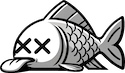
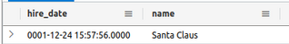
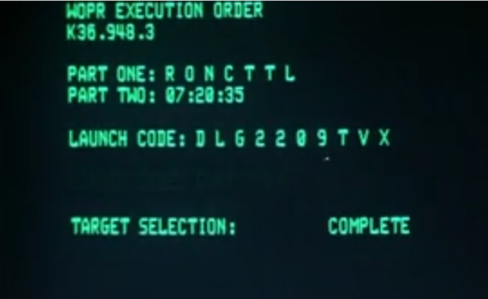
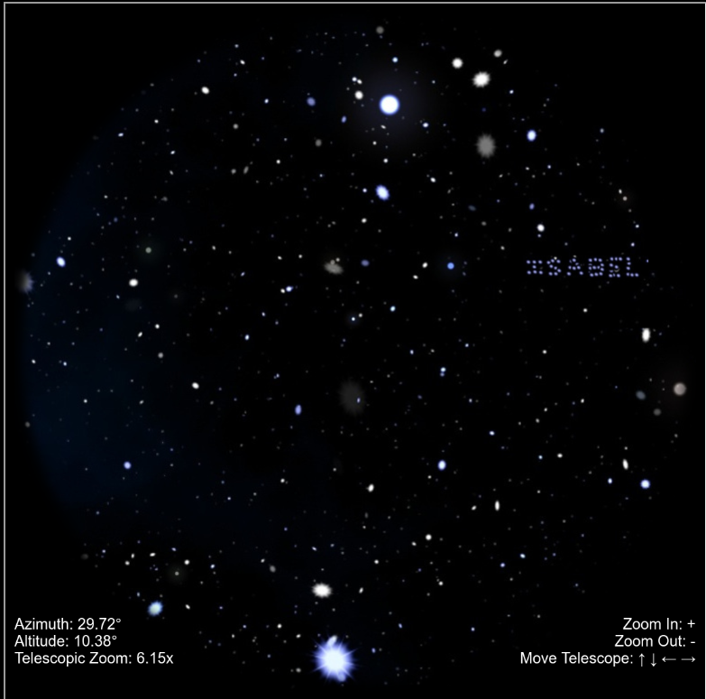
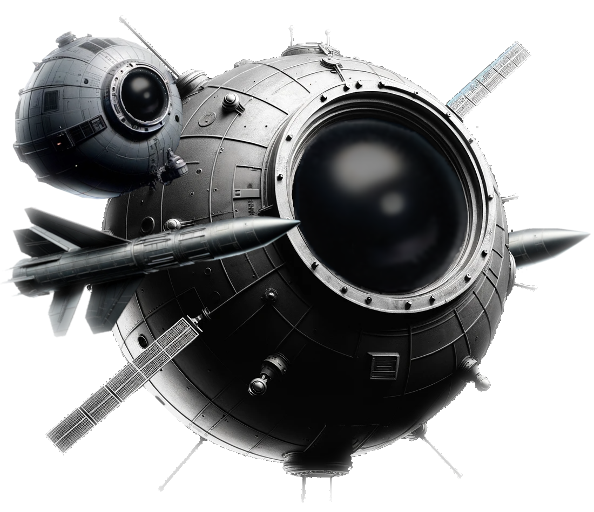
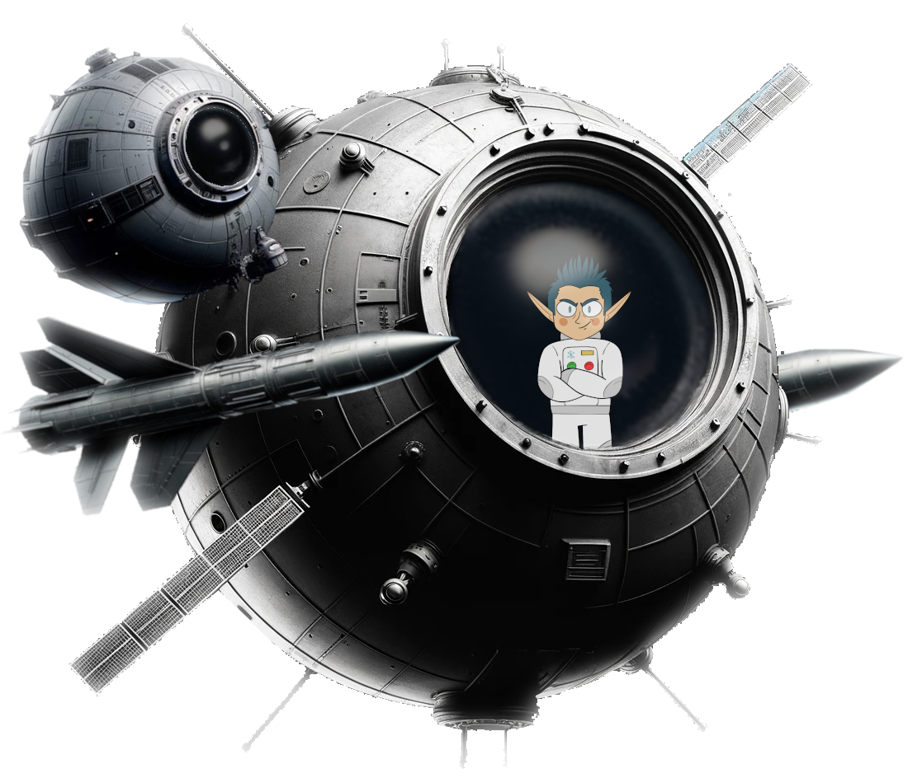

# Holiday Eggs

### Jason
This year Jason is a fish on Steampunk Island, Coggoggle Marina:  
  
He is "not a dead fish" just like last year where he was a canary stating ("I'm not dead. I'm merely resting.").
***

### Santa Claus hiring date
In objective 13, table "Employees", it is shown that Santa was hired on December 24th of year 1.  

***

### War Games
The table "messaging" of objective 22 contains the launch codes of the film war games.  

***

### Hack Space Con 2024
On the right of the Zenith SGS computer on Space Island is a "Hack Space Con 2024" poster.

***

### "You are Awesome!"
On Pixel Island there is on the right hand side the claim "You are Awesome!" on the background picture.

***

### Isabel
In the telescope you can see close to the top right corner the name "ISABEL" written in space.  

### Jack in the Sky
Also in the telescope a Pod should be visible, although I was not able to spot it.  
Without full game completion it is empty.

After completion, Jack is in the Pod.

### Access Speaker Phrase
The phrase for the Space Island Door Access Speaker
```
And he whispered, 'Now I shall be out of sight;
So through the valley and over the height.'
And he'll silently take his way.
```
is from "The Frost" by Hannah Flagg Gould.
<!--stackedit_data:
eyJoaXN0b3J5IjpbODYyNTI1MDA4LDE3ODA1OTkwMjYsMTA1Mz
A1NjExNCwxNzU3ODI5OTk4LDEwNDE4OTQ3ODgsMTExMzQ1NTUy
LDEzNTU1NTgzMjEsNTA4NTE2NjEsLTU3NzQwMzM5LC00MzU1NT
IwODEsLTE4NjAzNDEzNTUsLTk0MTMwMTg3MiwxMjQ4MTA3ODMw
XX0=
-->