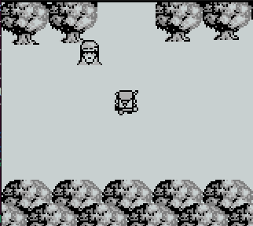
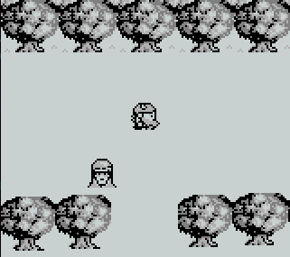
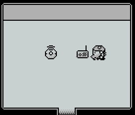

# Objective 10: Game Cartridges: Vol 2
**Location: Pixel Island: Driftbit Grotto**  
**Hints provided by Dusty Giftwrap**  
**Gameboy Cartridge Detector provided by Dusty Giftwrap**

The Game Cartrige 2 can be found at the above location at 3/20.
It can be started anytime from the "Items" section in the game.
There are two different versions of this game. When the game is started, it is randomly chosen which one is selected.
The only difference between both is, that a specific screen in one game is open on the top and you the player is pushed down a few steps when trying to pass. The other version is just the opposite: The screen is open on the bottom and the player is pushed up when trying to pass.

game0:  
  
game1:  

To solve this challenge, both versions of the game were byte compared in order to find, where the "push down"/"push up" definition is done. It turned out, that on byte position `0x17c80` [game0](https://gamegosling.com/vol2-akHB27gg6pN0/rom/game0.gb) has a `0x02` and [game1](https://gamegosling.com/vol2-akHB27gg6pN0/rom/game1.gb) a `0x01`.
After changing this byte in the game0 binary to `0x01` , the character is not pushed down anymore and instead pushed up effectively passing the "magical border".
The [modified game](game-solved.gb) can now be played in a Gameboy simulator like VisualBoyAdvance.

In the  
  a [Morse code audio](Morse-Code.m4a) is played. This was recorded and afterwards decoded using an audio [Morse code decoder](https://morsecode.world/international/decoder/audio-decoder-adaptive.html).

Answer: **GL0RY**

**Achievement: Game Cartridges: Vol 2**
<!--stackedit_data:
eyJoaXN0b3J5IjpbMjEwMDYyOTA2MCwtNDYyNjMzNjQ2LC0xMj
g0ODA4ODcwLC0yMTQwMzQwMjM3LDcyNDA4MTA4MSwxODY5Nzgx
NDExLDk1MzMyNTI3NCwtMjAxMDE5MjYzXX0=
-->