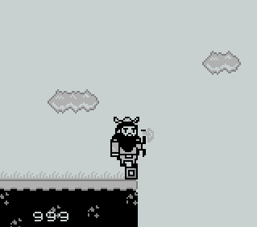
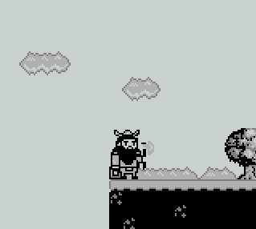

# Objective 11: Game Cartridges: Vol 3
**Difficultree: 🎄🎄🎄**  
**Location: Steampunk Island: Rusty Quay**  
**Hints provided by Dusty Giftwrap**  
**Game Boy Cartridge Detector provided by Dusty Giftwrap**

The Game Cartrige 3 can be found at the above location at 23/31. As Rosty Quay is a maze, it is advised to zoom out in the browser to find the right way.

The game can be started anytime from the "Items" section in the game.

The game was solved using the VisualBoyAdvance simulator.

In the game there are effectively two challenges:

### Obtain 999 coins
There are three different kinds of coins in the game with values 1, 10, and 100. The game has overflow issues so that is it impossible to make 999 with regular gaming.
In order to analyze, how/where the amount of coins is stored, the game status was backed up using the simulator prior and after obtaining coins.
Using that it was found that the single digits of the coins amount are stored in these locations of the saved games (they are GZIP compressed and need to be uncompressed for these modifications):

- 100s: `0x44d8`
- 10s: `0x44a4`
- 1s: `0x4470`

Setting these three bytes to `9` in the backup file results in an amount of `999` coins after the restore.

### Pass the gap
On the far right of the game, there is a gap and it is impossible to jump over it.

So the idea was to modify the X position of the game character in a saved game, so that after a restore the gap was passed.
After several tests it was found, that the X position is stored in byte position `0x4432` (low) and `0x4433` (high) of the backup.
If the game gets saved in the screen where the character is positioned in front of the gap (to have the right scene), the "high" position can be changed to `0x40`. After a [restore](game0.sgm) , the game character is on the right of the gap.

Answer: **!tom+elf!**

**Achievement: Game Cartridges: Vol 3**
<!--stackedit_data:
eyJoaXN0b3J5IjpbLTExNTQ5MDk4MTcsLTExMzU5Njk1MTcsLT
ExNDMxNzAzOTcsLTkwNDE0MzkyOCwtMTA1MTE1MzY1MCw4Mzc0
Mjg0MDUsMTQ0ODU3MTk1OCwtMTE0MTg0NTI4OSwtMTY1NjY0Nz
Y1NCwtMjU1Njk1MDQ2LC0yMDEwMTkyNjNdfQ==
-->