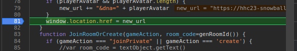
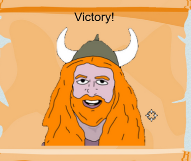

# Objective 2: Snowball Fight
**Location: Christmas Island: Frosty's Beach**  
**Hints provided by Morcel Nougat**

In this game, the player has a snowball fight against Santa and some Elves.
In single player mode the player is assisted by "Elf the dwarf".

In order to summon "Elf the dwarf" as helper, the JavaScript code has to be tweaked to launch the game with the additional parameter `singlePlayer=true`. To do so, a breakpoint can be set in the browser developer tools at the location where the game is launched.

In addition, to make the game easier, it is possible to set the damage of the opponent's snowballs to 0.
For this, open the browsers console, set the context to "room/" and modify the damage variable `snowballDmg=0`

**Achievement: Snowball Fight**
<!--stackedit_data:
eyJoaXN0b3J5IjpbLTI4MDM0ODA3OCw3NDk0MDQ1MjgsMTM2MT
EwMjc4OSwtMTczMDYxMTgzMSwxNTQyOTM5OTUxXX0=
-->