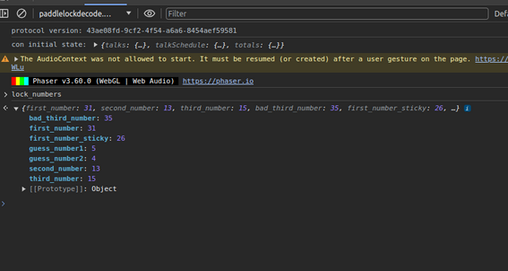

# Objective 8: Faster Lock Combination
**Difficultree: 🎄🎄**  
**Location: Steampunk Island: Brass Bouy Port**  
**Hints from Bow Ninecandle**

This objective is about picking a "Faster Lock" padlock with a dial using three digits between 0 and 39 (simulating a "Master Lock" padlock).

There are two ways to solve this challenge, the classic way and the hacking way.

### Picking the classic way
Bow Ninecandle provides a hint to a [video](https://www.youtube.com/watch?v=27rE5ZvWLU0) showing a way to decode this type of locks.
Using this information, it is still some effort to open the lock, but after a few attempts it is possible.

### Hacking the simulation
Using the browser web developer console, there is a variable `lock_numbers` in the context `paddlelockdecode.com` revealing all three numbers. In addition, the other sticky number and guess number (from the classic way) are shown.

**Achievement: Faster Lock Combination**
<!--stackedit_data:
eyJoaXN0b3J5IjpbLTk1NjI2NDkwMiwyNTk4NDA4NzIsLTIwMT
AxOTI2M119
-->