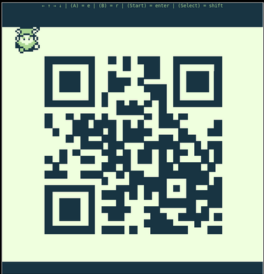

# Objective 9: Game Cartridges: Vol 1
**Difficultree: 🎄**  
**Location: Island of Misfit Toys: Tarnished Trove**  
**Hints provided by Dusty Giftwrap**  
**Gameboy Cartridge Detector provided by Dusty Giftwrap**

The Game Cartrige 1 can be found at the above location at 31/35.
It can be started anytime from the "Items" section in the game.
This starts a Gameboy simulator within the game.
The main objective in the game is a broken QR code which has to be repaired.
It is possible to make music to uncover, which black block can be moved (by pushing it) and which locations are expected to receive a black block.

Most of the blocks to be moved have their target locations nearby. Only one block has to be pushed from the left hand side to the outside, around the QR code and then finally inserted from the right hand side to the target location.

Special care has to be taken during the game, as the block can only be pushed forward and especially on the lower right is it quite crowded. Proper planning is paramount.

Interestingly, even the "corrected" QR code is not a valid one.  
Once completed,  a different QR code is displayed as solution:

This is pointing to `http://8bitelf.com`. This web page reveals `flag:santaconfusedgivingplanetsqrcode`, making the answer finally **santaconfusedgivingplanetsqrcode**.

**Achievement: Game Cartridges: Vol 1**
<!--stackedit_data:
eyJoaXN0b3J5IjpbMTM4MjI5NzEzNiwyMTA3MTE5NzksMjExMj
k1Mzk4LC0yMDU4ODEzMzU0LC0yMDEwMTkyNjNdfQ==
-->