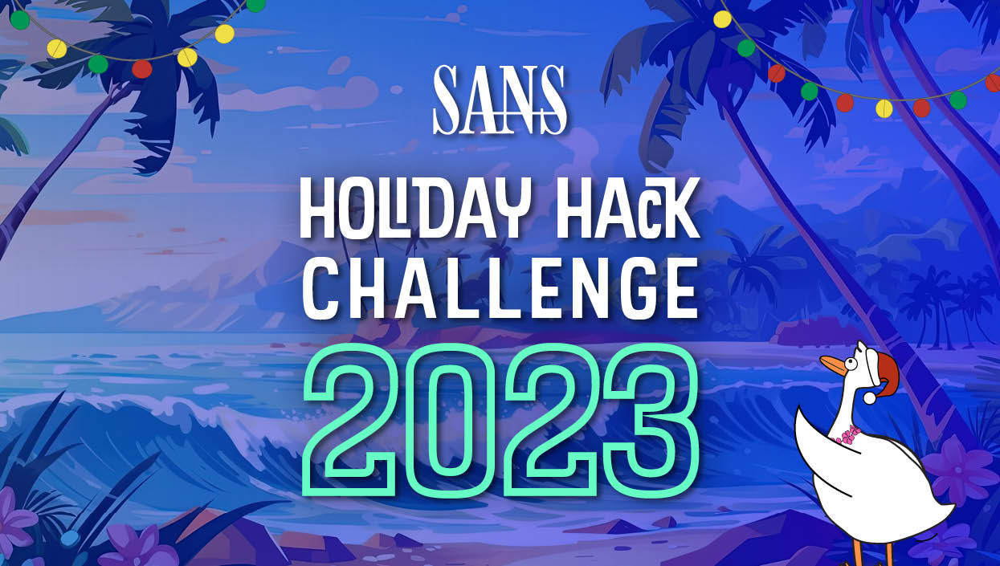
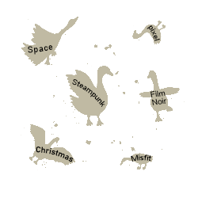

# The 2023 SANS Holiday Hack Challenge
**Write-up submitted by Joerg Schwarzwaelder** (hhc@schwarzwaelder.name)  
**In-game character: joergen** 

**Disclaimer:** All information and code in this repository is provided as-is, probably not without errors and not ready for production use.

 

## A Holiday Odyssey | Featuring 6: Geese A-Lei'ing!

**Background information:**  
Again the game title is a reference to the ["Twelve days of Christmas"](https://en.wikipedia.org/wiki/The_Twelve_Days_of_Christmas_%28song%29), after "2 Turtle Doves", "3 French Hens", "4 Calling Birds", "5 Golden Rings", now "6 Geese A-laying" (likely next year "7 Swans A-swimming").  
This year the Holiday Hack Challenge moved from the cold Northpole to the Geese Islands in the Pacific Ocean.  
There are in total six islands with different ports where the player can disembark.

The player can move between the islands with a ship, which can also be used for fishing (objectives 23 and 24) and boat racing.  

It turned out that Jack recruited Wombley Cube and created the AI ChatNPT. With this he made Santa and the Elves move to the Geese islands. Jack has a geostationary satellite there to intercept and manipulate all communication (on North Pole this is not possible).

[Online Game](https://2023.holidayhackchallenge.com/)

[Location of NPC, Terminals, and Items](Directory.md)

## Main Objectives

 - [Objective 1: Holiday Hack Orientation](Objective-1)
 - [Objective 2: Snowball Fight](Objective-2)
 - [Objective 3: Linux 101](Objective-3)
 - [Objective 4: Reportinator](Objective-4)
 - [Objective 5: Azure 101](Objective-5)
 - [Objective 6: Luggage Lock](Objective-6)
 - [Objective 7: Linux PrivEsc](Objective-7)
 - [Objective 8: Faster Lock Combination](Objective-8)
 - [Objective 9: Game Cartriges: Vol 1](Objective-9)
 - [Objective 10: Game Cartriges: Vol 2](Objective-10)
 - [Objective 11: Game Cartriges: Vol 3](Objective-11)
 - [Objective 12: Na'an](Objective-12)
 - [Objective 13: KQL Kraken Hunt](Objective-13)
 - [Objective 14: Phish Detection Agency](Objective-14)
 - [Objective 15: Hashcat](Objective-15)
 - [Objective 16: Elf Hunt](Objective-16)
 - [Objective 17: Certificate SSHenanigans](Objective-17)
 - [Objective 18: The Captain's Comms](Objective-18)
 - [Objective 19: Active Directory](Objective-19)
 - [Objective 20: Space Island Door Access Speaker](Objective-20)
 - [Objective 21: Camera Access](Objective-21)
 - [Objective 22: Missile Diversion](Objective-22)
 - [Objective 23: BONUS! Fishing Guide](Objective-23)
 - [Objective 24: BONUS! Fishing Mastery](Objective-24)

## Holiday Eggs
Some [Holiday Eggs](Holiday%20Eggs.md) were discovered.
<!--stackedit_data:
eyJoaXN0b3J5IjpbMTIxNTQwMzY2NywtNjQ1ODM2MTgsMTgxNT
EyNjE2NCwtNTIzNzMzMDE4LC0xNzI5Mjk1NzIsLTQ3OTM0NjQ5
LDEwNTkxOTY5MjIsNDUxNTAxNTE1LC0xODE5Mjc0NTA0XX0=
-->